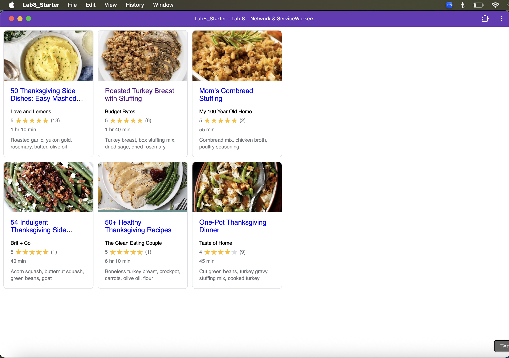

# Lab8-Starter
Solo Submission (No partners)

GitHub URL Page: https://anshreddy1.github.io/Lab8_Starter/

Graceful degradation × service workers:
Traditional graceful degradation adds fallbacks as we move down the capability stack—if JavaScript fails, the HTML still works; if CSS fails, the raw text still works. Service workers extend that idea to the network layer: they let the same high-end code path run while degrading gracefully when connectivity is poor or absent by intercepting requests and serving cached responses. In other words, service workers are graceful degradation for the internet itself—we start with the full online experience and “degrade” to cached assets without breaking the UX.

## PWA Install Screenshot

